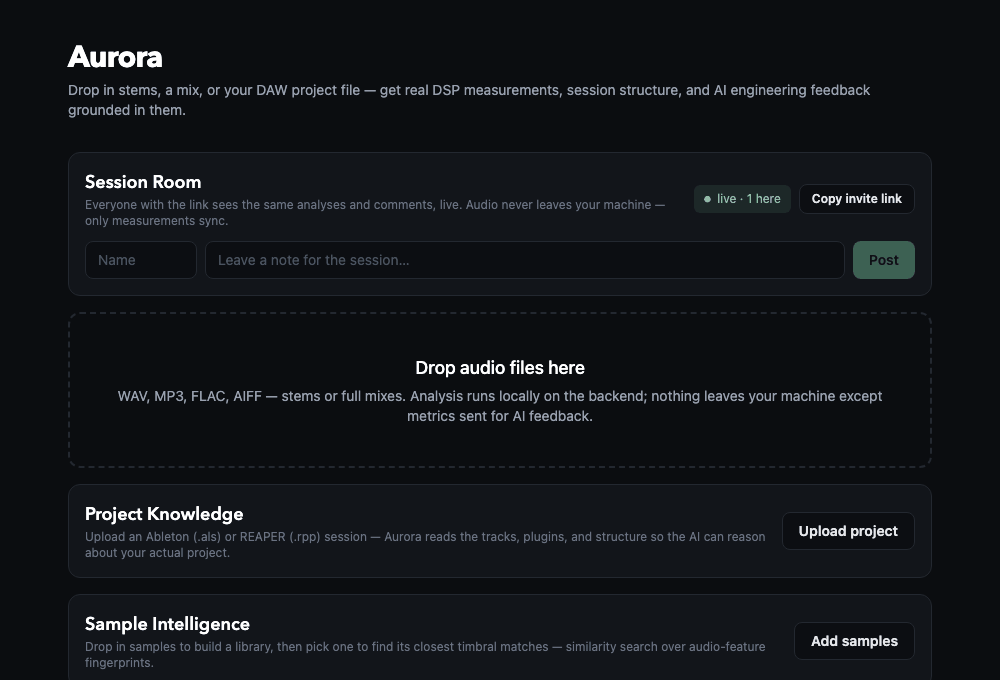
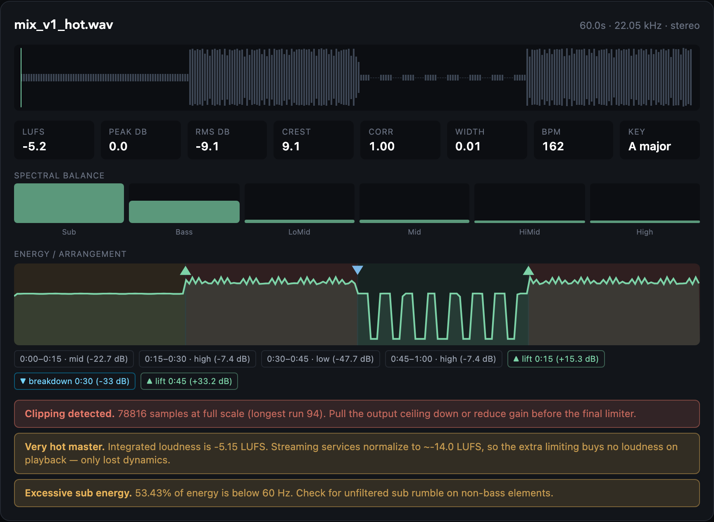
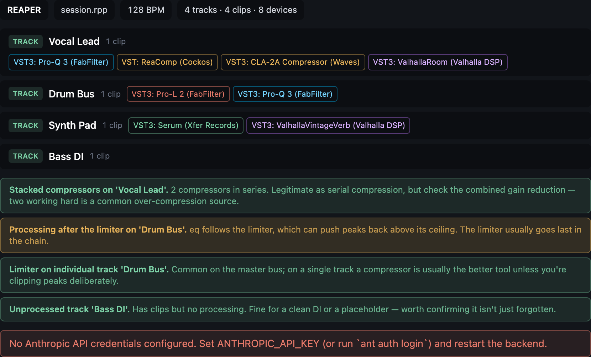
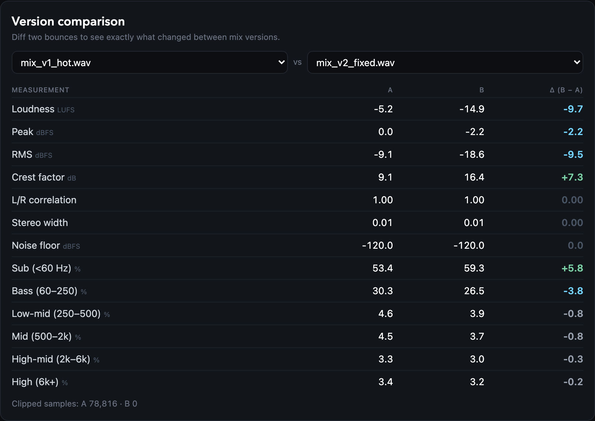
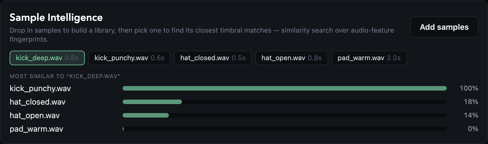
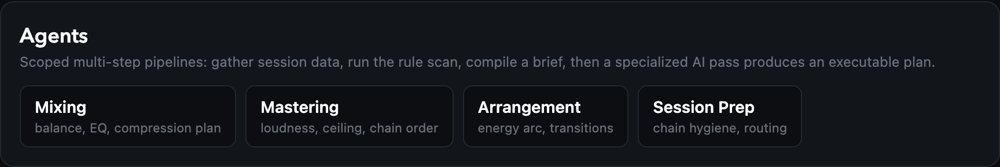
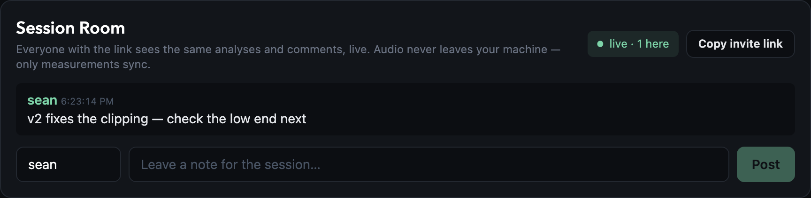

# Aurora

[](https://github.com/anytroops/aurora/actions/workflows/ci.yml)

An AI-native analysis environment for music production. Drop in a mix, a set of
stems, or your DAW project file and Aurora computes real engineering
measurements, reads your session structure, and uses those numbers to ground
AI feedback — instead of the generic mixing advice a language model gives when
it can't actually hear anything.



---

## What it does

### Engineering-grade DSP analysis

Every uploaded file is measured server-side with `librosa` and `pyloudnorm`:
integrated loudness (LUFS), true peak, RMS, crest factor, sample-accurate
clipping detection, L/R correlation, stereo width, six-band spectral balance,
spectral centroid, noise floor, tempo, and key.

Those measurements feed a rule engine that produces **deterministic findings** —
clipping, over-limiting, phase problems, low-mid buildup, dark top end. These
require no API key and no model call, so the tool is useful offline and the AI
layer has something factual to reason about.



### Arrangement analysis

MFCC-based agglomerative segmentation splits the track into sections, each
scored by energy, with lift and breakdown transitions detected at the
boundaries. In the shot above, the four 15-second blocks of the test track are
recovered exactly, along with a +15.3 dB lift, a −33 dB breakdown, and a
+33.2 dB lift.

### DAW project knowledge

Upload an Ableton Live set (`.als`, gzipped XML) or a REAPER project (`.rpp`,
plain text) and Aurora parses the session: tracks and their types, clip counts,
tempo, and every device in every chain — built-in devices by display name,
third-party plugins across VST / VST3 / AU / CLAP / JS.

### Plugin intelligence

Each device is categorized by role, then chains are checked for structural
problems: processing after a limiter, stacked compressors, reverb used as an
insert across many tracks instead of a send, tracks with clips but no
processing. Device chips are color-coded by role.



### Version comparison

Analyze two bounces and diff every measurement to see exactly what a revision
changed.



### Sample intelligence

Samples get a timbre fingerprint — MFCC statistics plus spectral shape
descriptors — searchable by cosine similarity. MFCC coefficient 0 is
deliberately dropped so matches track *timbre* rather than loudness: query a
kick and you get the other kick at 100%, hats at 11–19%, a pad at 0%.



### Agents

Four agents (mixing, mastering, arrangement, session prep) run a logged
multi-step pipeline — gather inputs, run the rule scan, compile a structured
brief, then a charter-scoped AI pass that returns an executable plan. The
deterministic steps always complete; only the final pass needs credentials.



### Session rooms

WebSocket rooms behind a shareable link. Analyses, project structure, comments,
and presence sync live between everyone connected. Audio never crosses the
wire — only measurements — and late joiners receive the full room state.



### Ask Aurora

Two chat modes. **Session** answers questions about your project and mix,
grounded in the parsed structure and measured values ("which tracks have no
processing?", "why does the low end feel crowded?"). **DSP code** is an
audio-programming assistant: JUCE, VST3/AU plugin architecture, real-time-safe
C++, and SIMD.

---

## Stack

| Layer | Choice |
| --- | --- |
| Frontend | React 18, TypeScript, Vite, Tailwind CSS v4, wavesurfer.js |
| Backend | FastAPI (Python 3.13), WebSockets |
| DSP | librosa, pyloudnorm, numpy, soundfile |
| AI | Anthropic SDK (`claude-opus-4-8`) |
| Tests | pytest (93 tests), Playwright for screenshots and the demo GIF |

Aurora runs as two processes: a Vite dev server and a single FastAPI service
that handles analysis, parsing, AI calls, and collaboration sockets.

```
frontend (5175) ──/api proxy──▶ backend (8001)
                                   ├── analysis.py     DSP measurements
                                   ├── arrangement.py  sections + energy
                                   ├── findings.py     rule engine
                                   ├── daw.py          .als / .rpp parsers
                                   ├── plugins.py      device roles + chain rules
                                   ├── samples.py      timbre fingerprints
                                   ├── agents.py       multi-step pipelines
                                   ├── ai.py           Claude prompts
                                   └── collab.py       WebSocket rooms
```

---

## Running it

**Backend** (port 8001):

```sh
cd backend
python3 -m venv .venv && .venv/bin/pip install -r requirements.txt
.venv/bin/uvicorn app.main:app --port 8001
```

**Frontend** (port 5175, proxies `/api` and `/api/ws` to the backend):

```sh
cd frontend
npm install
npm run dev
```

### Configuration

AI features call the Anthropic API. Export a key before starting the backend:

```sh
export ANTHROPIC_API_KEY=sk-ant-...
```

Without credentials the app still runs: analysis, parsing, rule-based findings,
version comparison, sample search, and collaboration all work, and the AI
surfaces return a clear "no credentials configured" message rather than
failing. The model defaults to `claude-opus-4-8`; override with `AURORA_MODEL`.

---

## Tests

```sh
cd backend
.venv/bin/pip install -r requirements-dev.txt
.venv/bin/python -m pytest
```

93 tests, no binary fixtures — every audio file and project file used in the
suite is synthesized at test time. Coverage is behavioral rather than
line-oriented:

- **DSP correctness against known signals.** A 0.25-amplitude sine must measure
  −12 dBFS peak with a ~3 dB crest factor; inverted channels must correlate at
  −1.0; band percentages must sum to 100.
- **Rule engine.** Each finding is exercised in both directions — the condition
  that trips it and the neighboring case that must stay silent (four clipped
  samples aren't clipping; a mono file skips the phase rules).
- **Parsers.** Structure, device naming, and clip counts for both formats, plus
  the failure paths: bad XML, wrong format, a track with no FX chain must not
  inherit the previous track's plugins.
- **Chain rules.** A limiter last in the chain is clean, a limiter mid-chain is
  not; reverb on three inserts is sprawl, reverb on three returns is correct.
- **API contracts.** Validation and the documented degraded behavior when no
  credentials are present.
- **Collaboration.** Broadcast, presence counting, deduplication, room
  isolation, state replay for late joiners, and malformed messages that must
  not drop the socket.

Screenshots and the demo GIF in this README are captured by driving the real
app in headless Chromium (`docs/capture_screenshots.py`, `docs/capture_demo.py`)
— regenerated, not hand-edited.

---

## Performance note: keeping the event loop free

The upload endpoints are `async def` because they `await` the request body, but
the work they then do — librosa analysis of a full song — is CPU-bound and
takes seconds. Left inline, that work runs *on the event loop* and blocks the
entire server: every other request and all collaboration WebSocket traffic
stalls behind it.

Measured against a real 5-minute 44.1 kHz song, with `/api/health` polled
concurrently:

| | Health latency (worst) | Requests served during one analysis |
| --- | --- | --- |
| CPU work on the event loop | 2941 ms | 1 |
| Offloaded via `asyncio.to_thread` | 3.6 ms | 82 |

The fix is one line per endpoint, but the failure mode is invisible until you
generate concurrent load — a single-user browser session never reveals it.
`tests/test_concurrency.py` locks it in by asserting on *throughput* rather
than latency: when the loop is blocked, a competing request never gets
scheduled at all, so its own measured latency stays deceptively small while the
server serves nothing.

---

## Scope

This started as a specification for a distributed "AI studio operating system"
— Neo4j, Qdrant, Redis, Kubernetes, LangGraph orchestration, a JUCE code
assistant, real-time multi-user collaboration. That is a multi-team product.

What is here instead is the subset that genuinely runs end to end on one
machine, built one feature at a time. Every capability in this README is
implemented and tested; where the original design called for infrastructure
that wouldn't earn its complexity at this scale, the honest version was built
instead — file parsing rather than a graph database, in-process similarity
search rather than a vector store, a single service rather than a cluster.

The one thing Aurora deliberately does not claim: it reasons about
*measurements and session structure*, not audio it has listened to, and it sees
plugin names and chain order but not parameter values. The prompts say so
explicitly, so the model qualifies its advice instead of inventing knob
settings.
